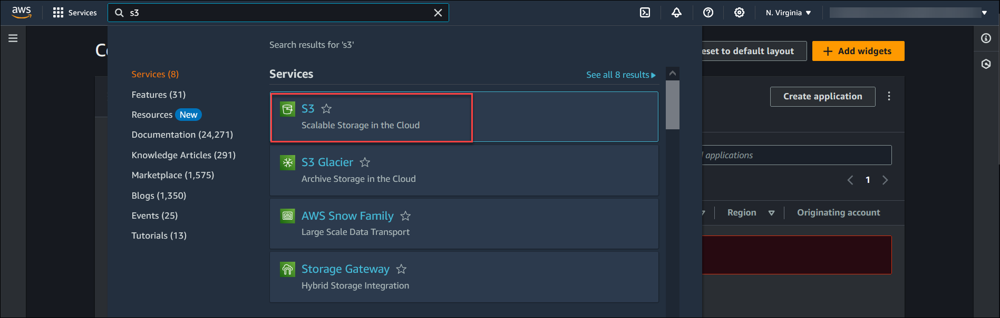
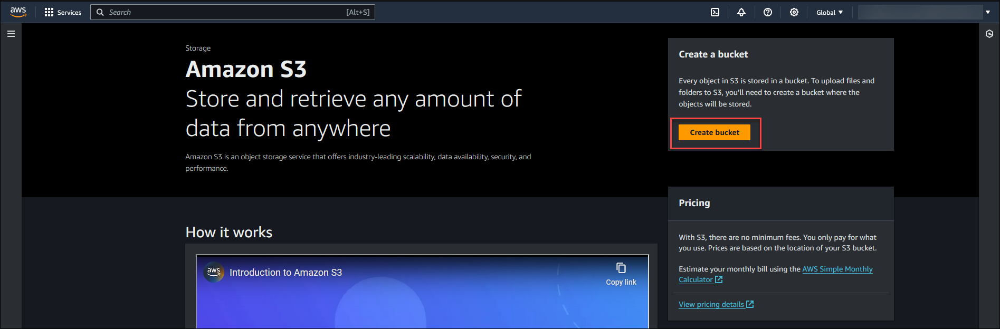
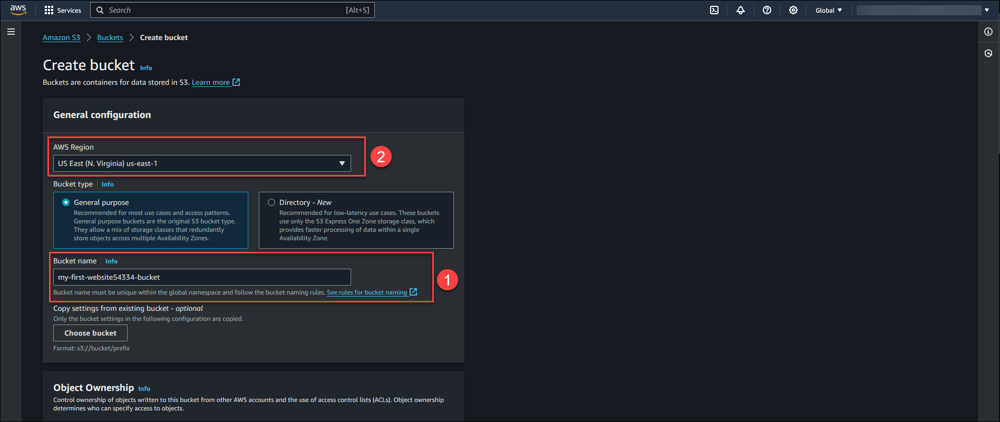
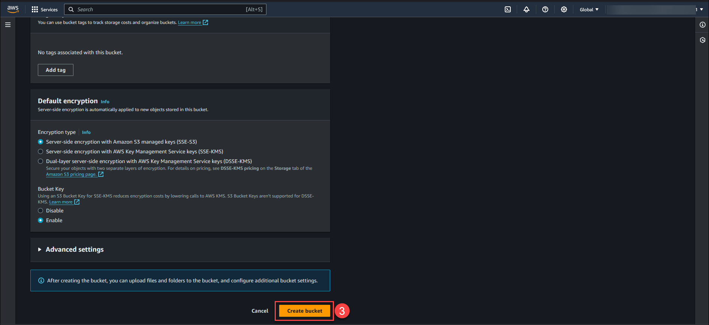
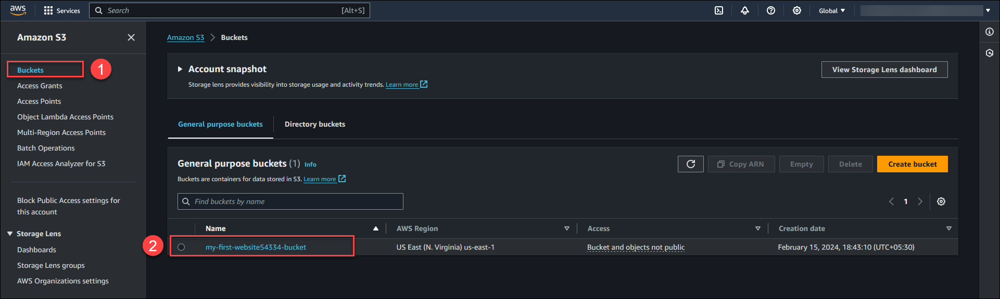
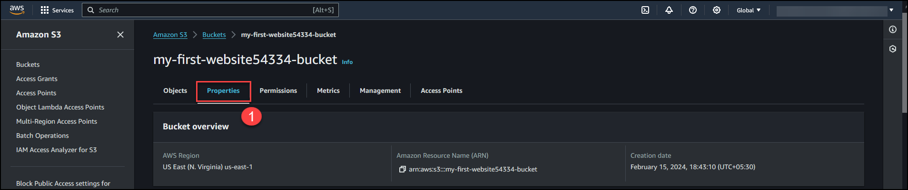
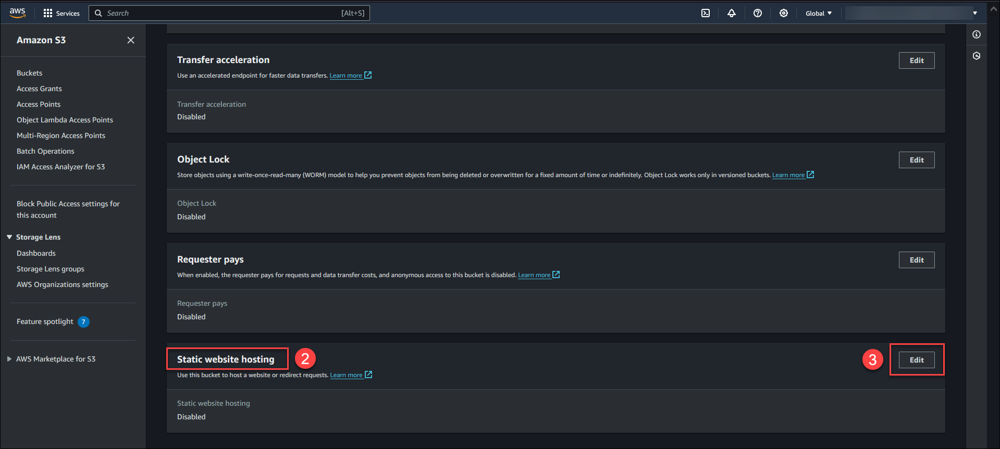
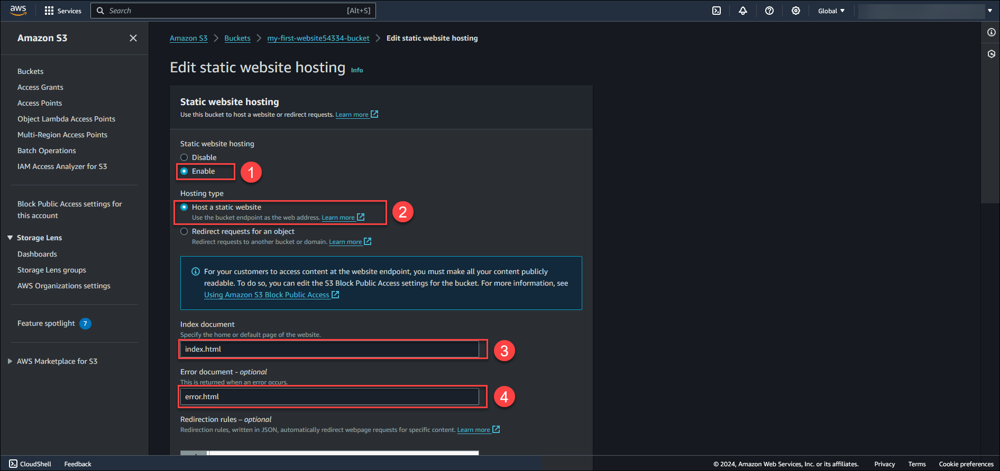
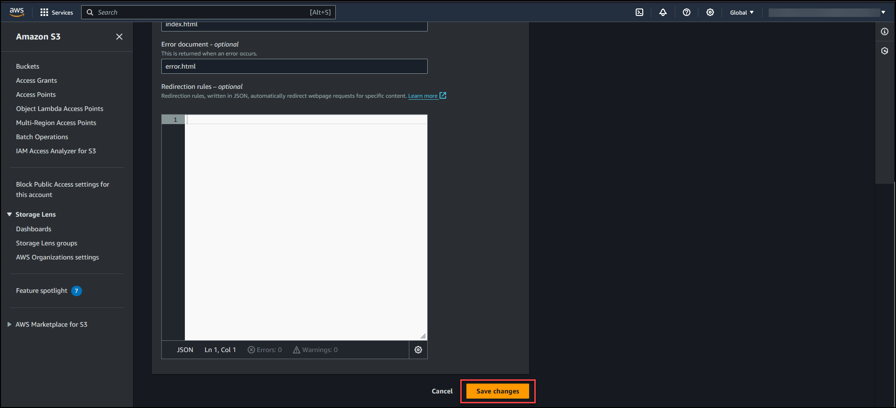
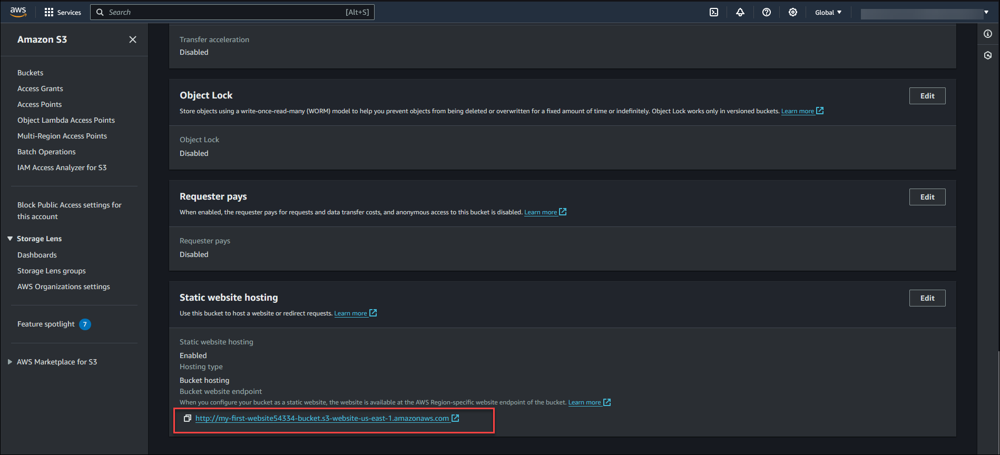

# Objective
To learn, How to create a Static Website using Amazon S3.

# Overview
In this Lab, You will learn to create a static website using Amazon S3 service. Hosting is static website on Amazon s3 is simple ,easy and cost effective.

# Content:

Here you will get to perform following exercises
- Exercise 1: Create an Amazon S3 bucket
- Exercise 2: Configure the Amazon S3 bucket to host static website and allow public access.
- Exercise 3: Create an Amazon S3 bucket policy.
- Exercise 4: Create an static webpages and upload it to Amazon S3 bucket 
- Exercise 5: Access the Static Website over browser

# Exercise 1: Create an Amazon S3 bucket
In this exercise you will learn how to create a standard static website.Amazon S3 is a scalable object storage service provided by AWS.

## Before proceeding further we need to consider following mentioned rules while deciding name for Amazon S3 bucket.
- S3 bucket name must be unique.
- It must be between 3 and 63 characters long
- It must consist only of lowercase letters, numbers and hyphens (-).
- It must begin and end with a letter or number.

Lets start with exercise

Step  1: Go to Amazon Management console and Type **S3** in the top search bar field and Navigate to S3 console page.

Step 2: Click on **Create Bucket**.

Step 3: 
Enter the **Bucket name** **(1)** which should follow the S3 bucket naming rules(**Example my-first-website54334-bucket** ). Select the AWS Region **(2)** where you want your S3 bucket to reside.  .Keep the other S3 bucket configuration as default values.Click on **Create bucket** **(3)**.

**You have successfully create Amazon S3 bucket.**

# Exercise 2: Configure the Amazon S3 bucket to host static website and allow public access

In this exercise, you will modify the S3 bucket properties to allow hosting the static website.By default, Amazon S3 buckets are configured to block public access.So we will allow public access for our s3 bucket.

Lets start with exercise

Step 1: Navigate to S3 bucket which we create earlier **my-first-website54334-bucket**

Step 2: Choose **Properties tab** (1) and Scroll down to **Static website hosting** (2) section. and click on **edit** (3).

Step 3: Select **Enable** (1) for static website hosting option.

- In **Hosting type**, Select **Host a static website (2)**.
- In **Index document**, enter **index.html (3)**.
- In **Error document**, enter **error.html (4)**.

Step 4: Click on **Save Changes**.

You have successfully configured the S3 bucket to host static website. In **Static website hosting** section S3 will generate **Bucket website endpoint** which we will use later to access our static website.

 Example- http://my-first-website54334-bucket.s3-website-us-east-1.amazonaws.com.

# Exercise 3: Create an Amazon S3 bucket policy.

