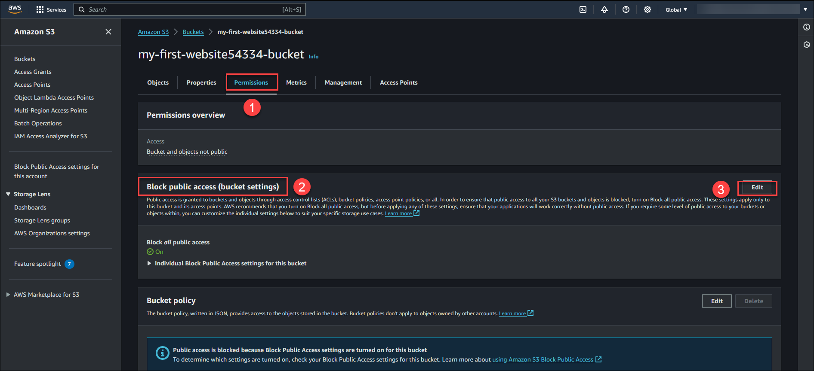
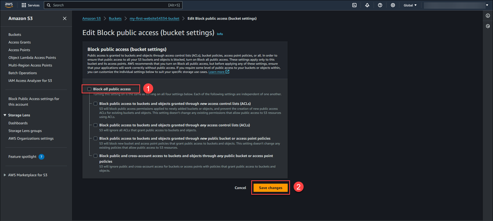
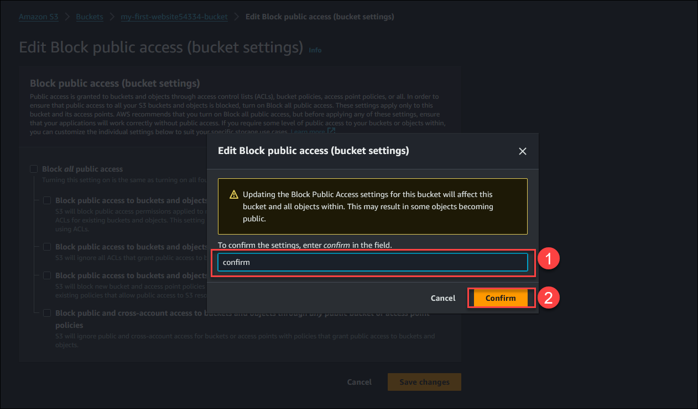
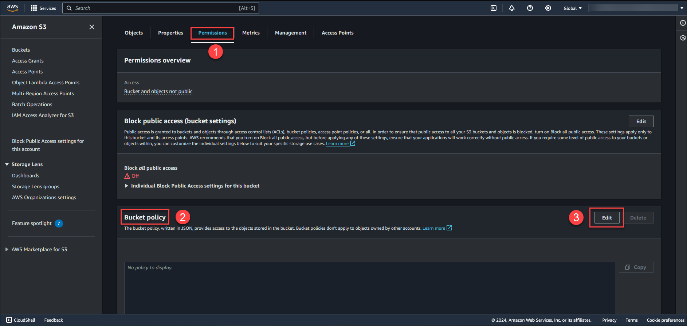
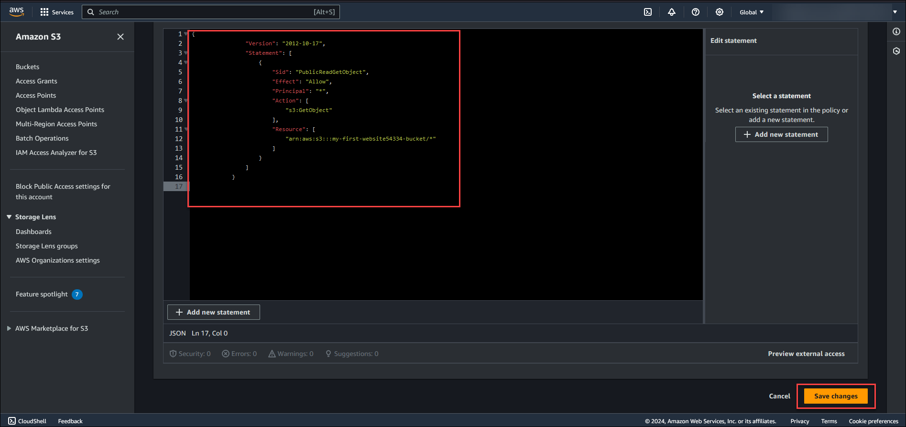
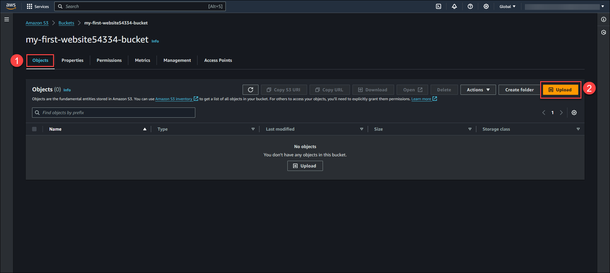
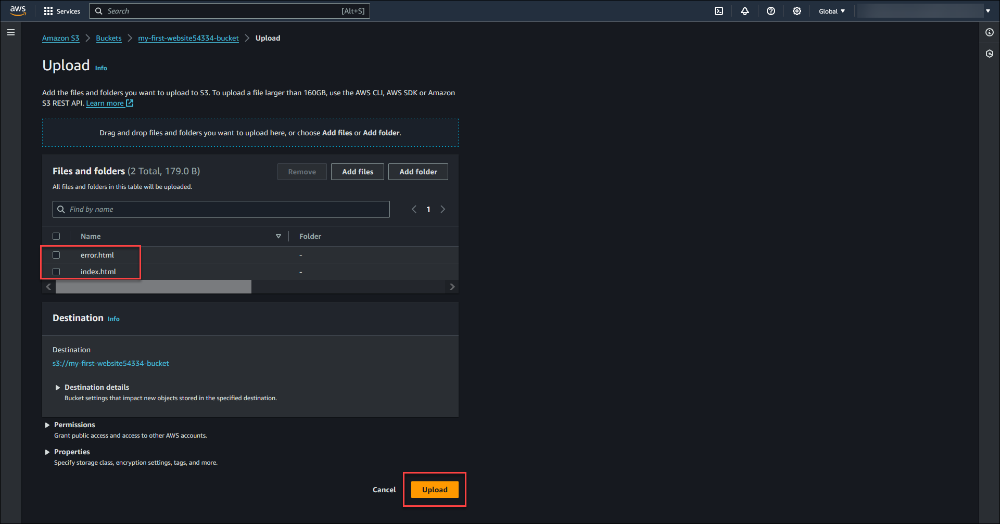
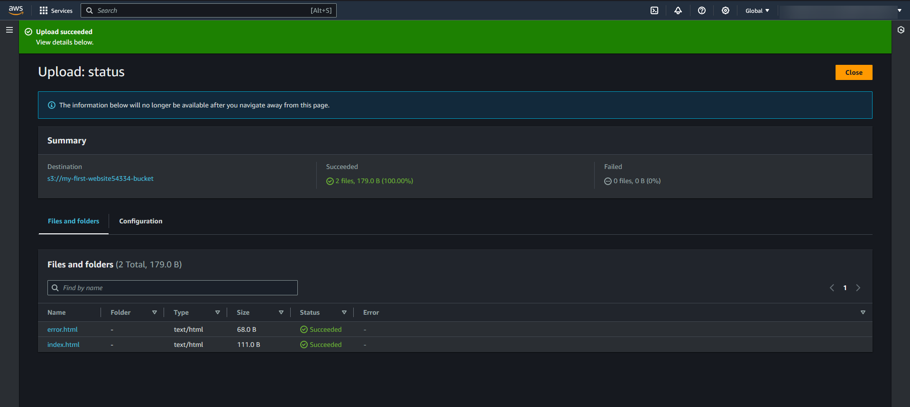
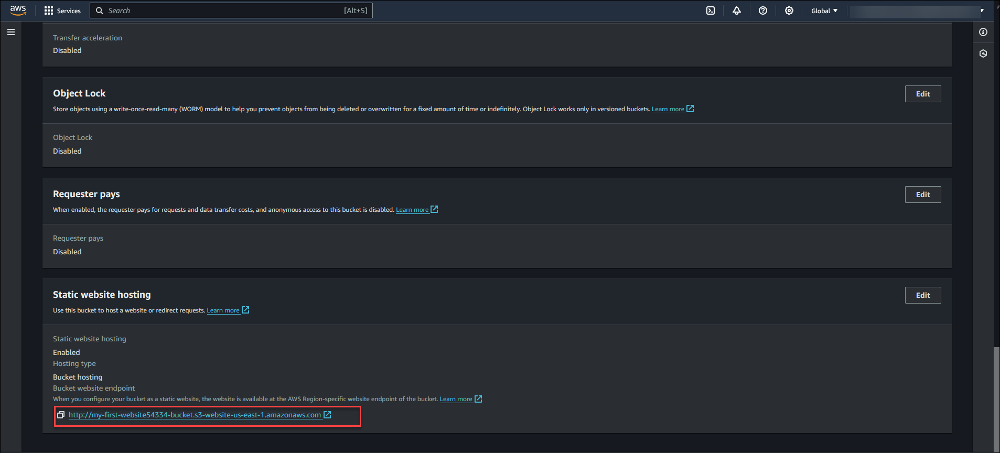
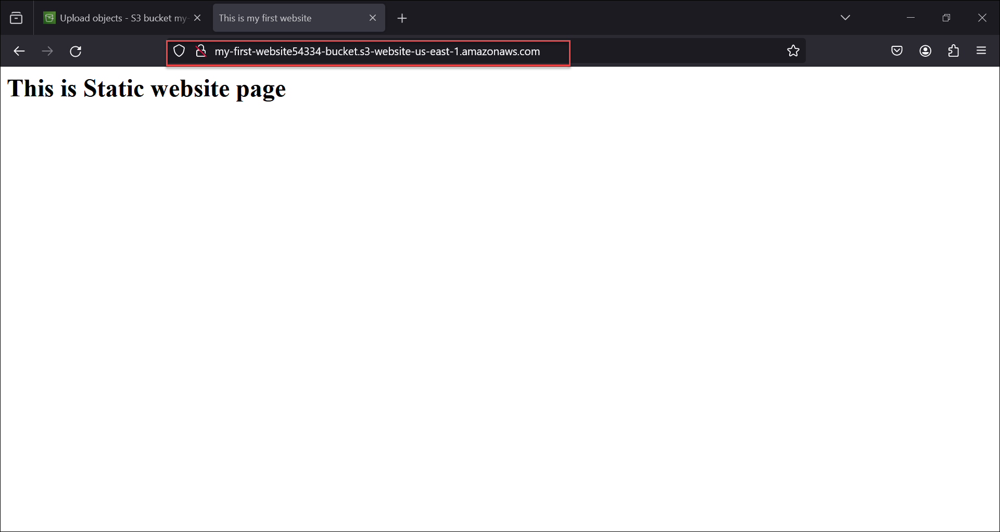

# Objective
To learn, How to create a Static Website using Amazon S3.

# Overview
In this Lab, You will learn to create a static website using Amazon S3 service. Hosting a static website on Amazon s3 is simple ,easy and cost effective.

# Content:

Here you will get to perform following exercises.
- Exercise 1: Create an Amazon S3 bucket.
- Exercise 2: Configure the Amazon S3 bucket to host static website and allow public access.
- Exercise 3: Create an Amazon S3 bucket policy.
- Exercise 4: Create an static webpages and upload it to Amazon S3 bucket. 
- Exercise 5: Access the Static Website over browser.

# Exercise 1: Create an Amazon S3 bucket
In this exercise you will learn how to create a standard static website.Amazon S3 is a scalable object storage service provided by AWS.

## Before proceeding further we need to consider following mentioned rules while deciding name for Amazon S3 bucket.
- S3 bucket name must be unique.
- It must be between 3 and 63 characters long
- It must consist only of lowercase letters, numbers and hyphens (-).
- It must begin and end with a letter or number.

Lets start with exercise

Step  1: Go to Amazon Management console and Type **S3** in the top search bar field and Navigate to S3 console page.

Step 2: Click on **Create Bucket**.

Step 3: Enter the **Bucket name** **(1)** which should follow the S3 bucket naming rules(**Example my-first-website54334-bucket** ). Select the AWS Region **(2)** where you want your S3 bucket to reside.  .Keep the other S3 bucket configuration as default values.Click on **Create bucket** **(3)**.

**You have successfully created Amazon S3 bucket.**

# Exercise 2: Configure the Amazon S3 bucket to host static website and allow public access

In this exercise, you will modify the S3 bucket properties to allow hosting the static website.By default, Amazon S3 buckets are configured to block public access.So we will allow public access for your s3 bucket.

Lets start with exercise

Step 1: Navigate to S3 bucket which we create earlier **my-first-website54334-bucket**

Step 2: Choose **Properties tab (1)** and Scroll down to **Static website hosting (2)** section. and click on **edit (3)**.

Step 3: Select **Enable (1)** for static website hosting option.

- In **Hosting type**, Select **Host a static website (2)**.
- In **Index document**, enter **index.html (3)**.
- In **Error document**, enter **error.html (4)**.

Step 4: Click on **Save Changes**.

You have successfully configured the S3 bucket to host static website. In **Static website hosting** section S3 will generate **Bucket website endpoint** which we will use later to access our static website.

 Example- http://my-first-website54334-bucket.s3-website-us-east-1.amazonaws.com

# Exercise 2.2: Allow public access to the bucket
    Here we will learn how to modify bucket properties to allow public access.By default, Amazon S3 buckets are blocked for public access.If you want to use a S3 bucket to host a static website than you must allow public access to the bucket.

Step 1: Go to **Permissions tab (1)** and select **edit(3)** in **Block public access (bucket settings)(2)** section.

Step 2: Uncheck the **Block all public access** and click on **Save changes**.

Step 3: Enter **confirm (1)** and click on **confirm(2)**.

You have successfully completed this exercise.

# Exercise 3: Create an Amazon S3 bucket policy to allow public access to web content in Amazon S3 Bucket

Here you will learn to make the web content to accessible publically by applying bucket a policy.

Step 1: Choose the **Permissions Tab(1)** and under **Bucket policy(2)** section click on **Edit(3)**. 

Step 2: Copy the bucket policy provided below and paste it in **Bucket policy editor** and click on **Save changes**.

            {
                "Version": "2012-10-17",
                "Statement": [
                    {
                        "Sid": "PublicReadGetObject",
                        "Effect": "Allow",
                        "Principal": "*",
                        "Action": [
                            "s3:GetObject"
                        ],
                        "Resource": [
                            "arn:aws:s3:::my-first-website54334-bucket/*"
                        ]
                    }
                ]
            }

**Note: Arn provided in the above Bucket policy should be your S3 bucket arn. Example- **arn:aws:s3:::my-first-website54334-bucket/**

   
You have successfully applied the bucket policy.

# Exercise 4: Create an static webpages and upload it to Amazon S3 bucket

In this exercise, we will create a **simple HTML web page** and upload it to amazon S3 bucket.

## Exercise 4.1 : Create an HTML web page index.html and error.html 

Step 1: Here we have provided sample html code.Copy the sample code in text editor and save it as index.html 

            <html>
            <head>
            <title> This is my first website</Title>
            <H1> This is Static website page</H1>
            </head>
            </html>

Step 2: Next, below we have sample html code for error html page. Copy the sample code in text editor and save it as error.html.

            <html>
            <head>
            
 This site is not reachable

            </head>
            </html>

You have created a static index.html webpage and error.html webpage.

# Exercise 4.2 : We will upload the web content to Amazon s3 bucket

Step 1: Go to **Objects Tab (1)** and click on **Upload (2)** and select the web pages index.html and error.html file from the directory where you have saved your web pages which created in earlier exercise.

You will recieve confirmation message **Upload Succeeded**.

You have upload the web content successfully.

# Exercise 5: Access the Static Website over browser

Step 1: If you have completed the above exercises than you will be able to access the static website over an browser.

In Exercise 2 you have saved Bucket website endpoint.

**Note: Your S3 bucket endpoint will be different than the mentioned in sample arn.**

Bucket website endpoint Example- http://my-first-website54334-bucket.s3-website-us-east-1.amazonaws.com

you will use your S3 bucket endpoint to access S3 static website.

Step 2: Open the **http://my-first-website54334-bucket.s3-website-us-east-1.amazonaws.com** in your browser. If all the exercises are correctly performed as per instruction you will get below mentioned output.

